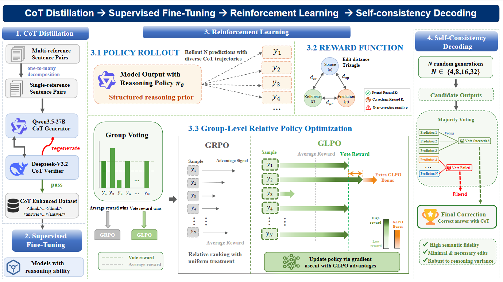

[中文](README.md) | [English](README_EN.md)

## 🙌来自作者
大家好，由于本框架流程是在一步一步探索中实现的，因此最初版本的可读性较差。为了方便复现，我在开源前进行了较大范围的重构，但可能因此产生各种未能发现的问题，如路径不一致、缺少部分代码等。若大家复现过程中有任何疑惑或发现了bug，欢迎提issue或直接通过作者邮箱讨论，我会在空闲时间尽量解决！

#  VAA-CSEC: Vote-guided Advantage Allocation for Chinese Semantic Error Correction

  <b>Yitong Han1, Nankai Lin1,2†, Juan Luo1, Hongyan Wu3, Lianxi Wang1, Shengyi Jiang1</b>

  1School of Information Science and Technology, Guangdong University of Foreign Studies 
  2Guangdong Engineering Research Center of Data Security Governance and Privacy Computing 
  3College of Computer Science and Technology, National University of Defense Technology

**VAA-CSEC** 是一个面向中文语义纠错任务的多阶段训练框架，结合了 CoT 蒸馏、监督微调（SFT）、强化学习（RL）和自一致性解码（self-consistency）。

在强化学习阶段，我们进一步引入 **GLPO (Group-Level Relative Policy Optimization)**，根据个体 rollout 奖励与投票聚合组奖励之间的差距重新分配 GRPO 优势，使强化学习训练目标与推理阶段使用的自一致性目标保持一致。

VAA-CSEC 在 **CSED-C** 数据集上优于所有基于 LLM 的基线方法，取得 **47.72% F0.5**，并实现所有方法中的最高召回率 **42.15%**。

在 **NaSGEC-Exam** 数据集上，VAA-CSEC 取得 **41.55% F0.5**，创造了新的 **SOTA**。

  

## 模型开源
模型权重已开源至huggingface，使用前请确认是否与训练数据集对应，[点此跳转](https://huggingface.co/Hanyiton/VAA-CSEC/tree/main)。

## 环境配置
推荐创建两个conda环境，分别进行LLaMAFactory的SFT训练和ms-swift的GRPO/GLPO训练

环境创建流程请分别参考[LLaMAFactory](https://llamafactory.readthedocs.io/en/latest/)和[ms-swift](https://swift.readthedocs.io/en/latest/GetStarted/Quick-start.html)的官方文档。

你可能会用到：
1. ms-swift官方文档中[Qwen3.5最佳实践说明](https://swift.readthedocs.io/zh-cn/latest/BestPractices/Qwen3_5-Best-Practice.html#rl)
2. 对于Qwen3.5中vllm与transformers版本不兼容问题，可见[ms-swift/issues/8188](https://github.com/modelscope/ms-swift/issues/8188)

## 数据处理
以CSED-C为例，蒸馏出的思维链保存在data\CSED-C\cot_sft_deidentified.json

处理数据前，请自行前往[CSED-C仓库](https://github.com/wyxstriker/CSED/tree/main/CSED-C)下载原数据，然后通过YuYi\scripts\build_alpaca_sft.py还原为SFT训练数据。

若想从0开始创建数据，请参考论文中的3.3 CoT Distillation以及Appendix C，但由于大模型生成的不稳定性，新数据可能会与论文有一定差别。

**由于NaSGEC-Exam初始数据并非alpaca格式，暂时还没想到好的还原方法，若有需要可以联系我获取蒸馏出的思维链部分。**

## SFT训练
请参考[LLaMAFactory官方文档](https://llamafactory.readthedocs.io/en/latest/)的标准训练流程，所使用模型以及超参数设置均在论文Experiment部分说明。

## GRPO/GLPO训练
详细流程请参考[YuYi\README.md](https://github.com/HanYiton/VAA-CSEC/blob/main/YuYi/README.md)
